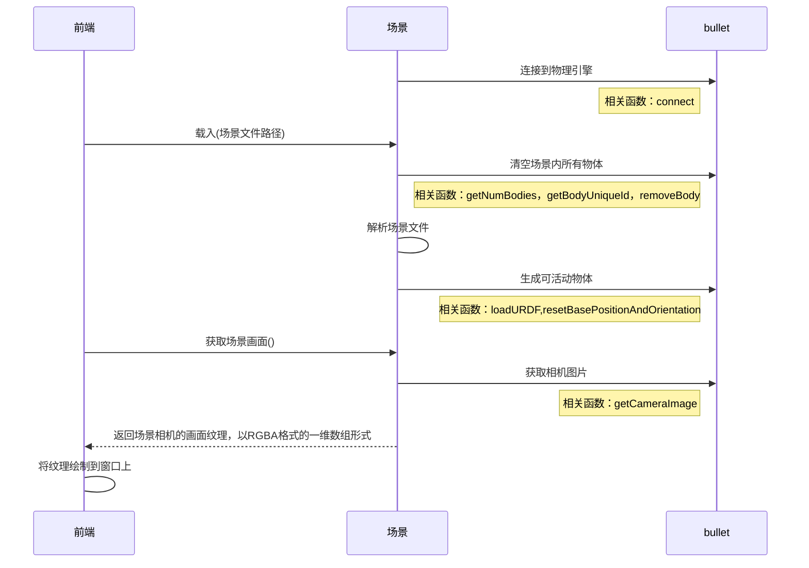
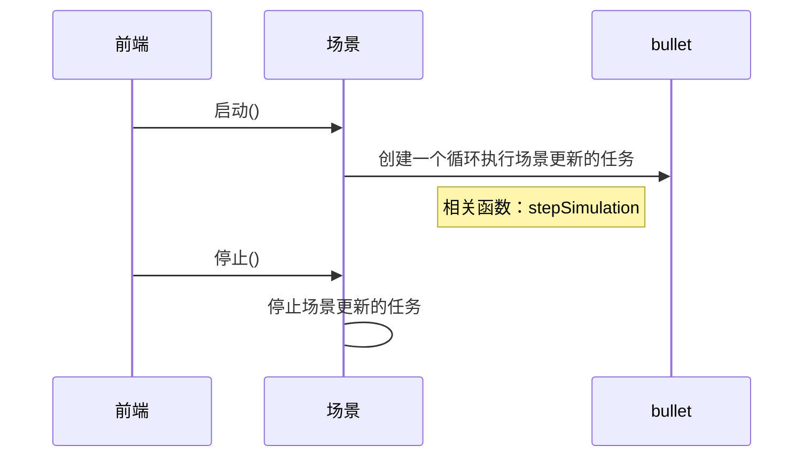
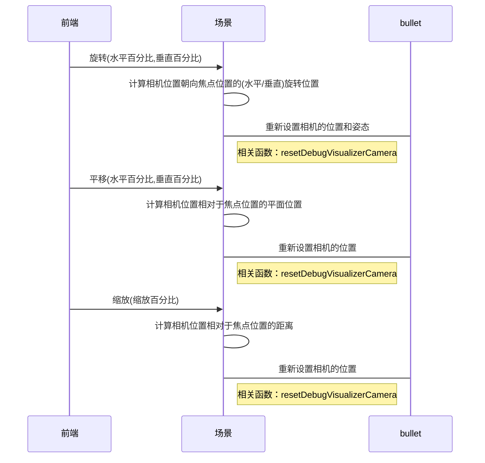
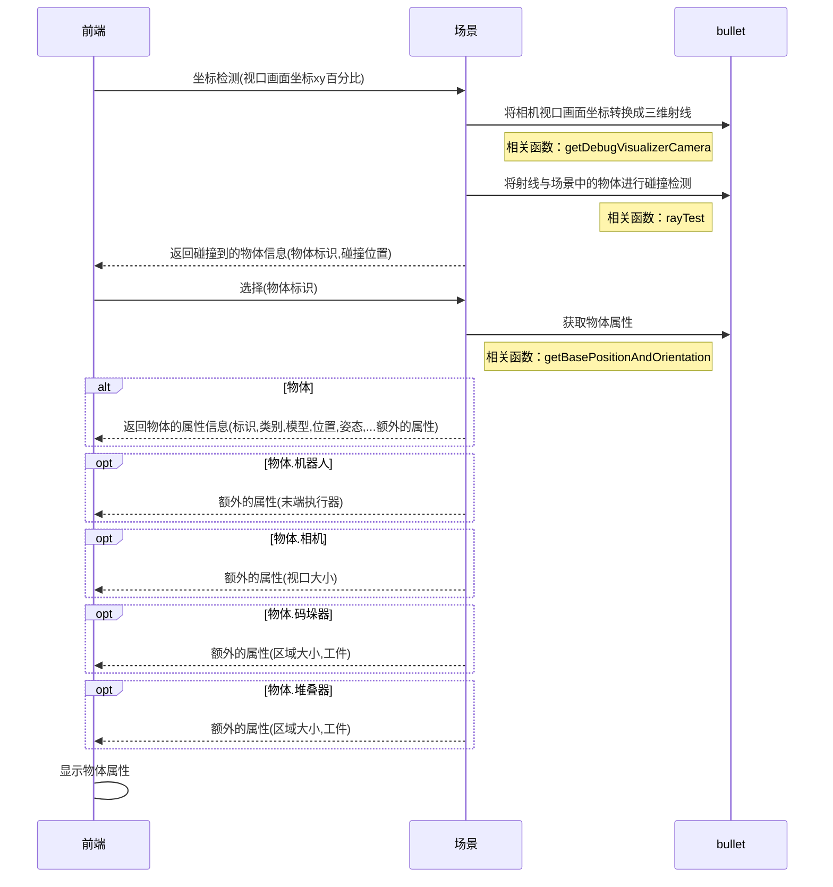
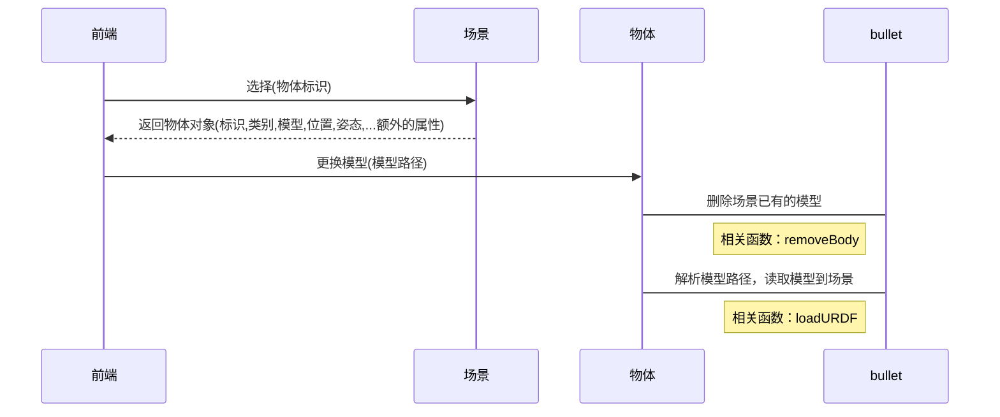
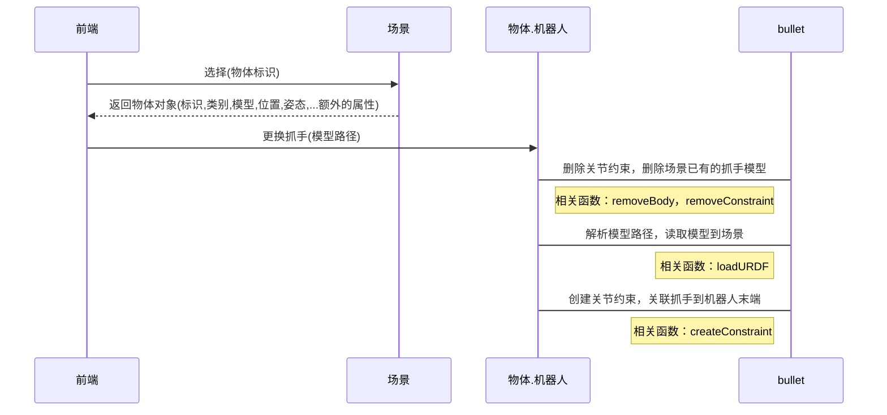
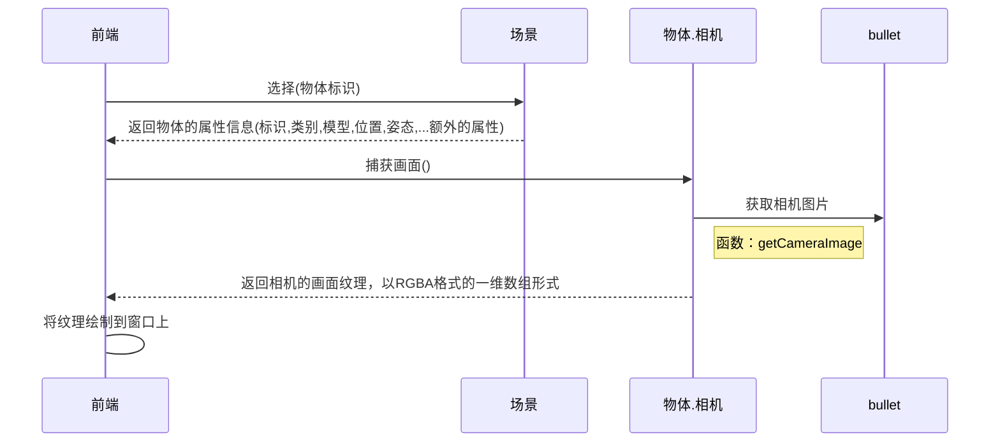
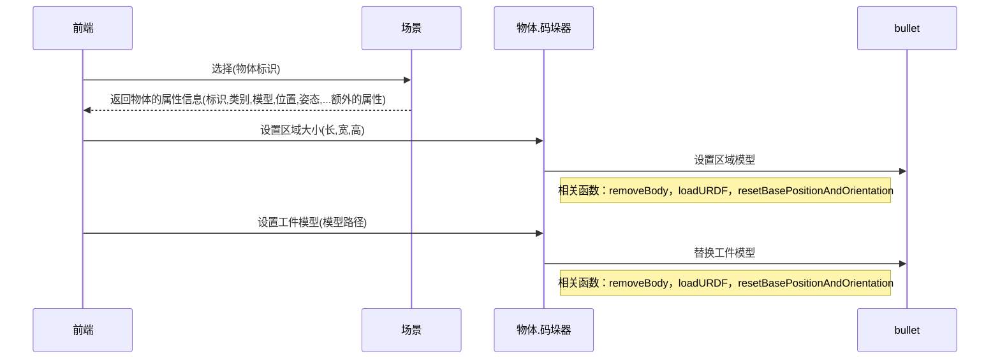
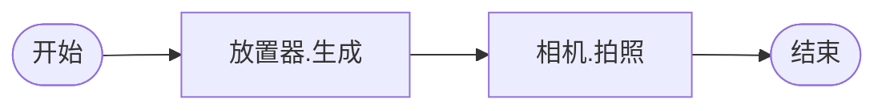
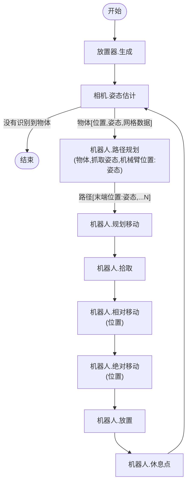

<h1 align="center">Digital-Twin</h1>

[TOC]

<div style="page-break-after: always;" ></div>

# 1 概述

        本文的目标在于梳理并定义前端业务接口规范，用于避免SDK开发者在不完全了解前端业务的情况下开发出不兼容的接口。 

## 1.1 安装

下载源代码：`git clone http://120.24.55.96:3000/MixedAI/GraspSim`

安装依赖：`pip3 install -r requirements.txt`

## 1.2 快速开始

获取一堆工件的深度图：`python3 test.py`

获取一堆工件的姿态数据：`python3 test0.py`

混合拆垛演示：`python3 test1.py`

无序抓取演示：`python3 test2.py`

虚拟相机拍摄点云：`python3 test3.py`

标定： `python3 test5.py`

# 2 工作计划

| 目标                | 任务                    | 问题                             | 备注                          |
| ----------------- | --------------------- | ------------------------------ | --------------------------- |
| 接口定义              | 场景查看                  | 载入/重置                          |                             |
|                   |                       | 获取物体标识                         |                             |
|                   |                       | 获取场景画面                         |                             |
|                   |                       | 暂停/继续仿真                        |                             |
|                   |                       | 平移/旋转/缩放/焦点                    |                             |
|                   |                       | 视图切换-前后左右                      |                             |
|                   |                       | 绘制原点/碰撞点                       | 实现较为复杂                      |
|                   |                       | 关闭场景                           |                             |
|                   | 场景编辑                  | 坐标检测                           |                             |
|                   |                       | 选择/添加/删除/保存                    |                             |
|                   |                       | 透明化                            |                             |
|                   |                       | 移动/旋转/缩放                       |                             |
|                   | 物体                    | 位置/姿态                          |                             |
|                   |                       | 标识                             |                             |
|                   |                       | 模型更换                           |                             |
|                   |                       | 纹理更换                           |                             |
|                   | 物体.机械臂                | 获取/设置末端执行器                     |                             |
|                   |                       | 获取/设置末端执行器姿态                   |                             |
|                   |                       | 获取/设置末端执行器位置                   |                             |
|                   |                       | 设置末端执行器数字输出                    |                             |
|                   |                       | 获取关节数                          |                             |
|                   |                       | 获取/设置关节位置                      |                             |
|                   |                       | 获取/设置速度                        |                             |
|                   |                       | 设置当前位置为休息点                     |                             |
|                   |                       | 前往休息点                          |                             |
|                   | 物体.相机                 | 获取相机画面                         |                             |
|                   |                       | 获取/设置标定参数                      |                             |
|                   |                       | 设置/清除点云                        |                             |
|                   | 物体.码垛器                | 区域参数                           |                             |
|                   |                       | 工件更换                           |                             |
|                   | 物体.放置器                | 区域参数                           |                             |
|                   |                       | 获取/设置工件                        |                             |
|                   |                       | 获取/设置工件纹理                      |                             |
|                   |                       | 获取/设置放置点                       |                             |
|                   |                       | 获取/设置总计工件数                     |                             |
|                   |                       | 获取/设置缩放因子                      |                             |
|                   |                       | 获取/设置放置模式                      |                             |
|                   | 工作流                   | 获取可用节点                         |                             |
|                   |                       | 设置/获取                          |                             |
|                   |                       | 启动/停止                          | 结束后崩溃                       |
|                   | ..................... | .............................. |                             |
| SimEngine<br/>陈君辉 | 验收要求                  | 载入物体的示例                        | 可以调节位置和姿态，并且与地面发生物理交互，如碰撞   |
|                   |                       | 获取RGBD图的示例                     | 显示RGB图，深度图展现为灰度图的形式         |
|                   |                       | 获取物体姿态的示例                      | 通过射线检测物体的存在，然后把该物体的姿态轴画出来即可 |
|                   |                       | 吸盘吸附物体的示例                      | 对力的控制功能                     |
|                   |                       | 夹爪拾取物体的示例                      | 对摩擦的控制功能                    |
|                   |                       | 控制一个关节的运动，使另一个关节进行同步运动         | 对关节同步的控制功能                  |
|                   | ..................... |                                |                             |
| DexSim<br/>李瑶     | 验收要求                  | 一堆工件生成的示例                      |                             |
|                   |                       | 一堆工件的深度图示例                     |                             |
|                   |                       | 一堆工件的姿态示例                      |                             |
|                   |                       | 控制机械臂+吸盘去拾取工件                  |                             |
|                   |                       | 控制机械臂+夹爪去拾取工件                  |                             |
|                   |                       |                                |                             |

# 3 业务流程

## 3.1 场景-载入场景并获取画面

        通过解析一个场景文件并加载其定义的物体到分拣场景中，通过渲染到纹理技术获取场景画面到前端显示。  

        文件定义如下：

```python
scene_profile = {
    "active_objects": [
        {
            "kind":"Robot",
            "name":"robot",
            "base":"./data/robots/ur5.urdf",
            "pos":[0,0,0],
            "rot":[0,0,1.57],
            "end_effector":"./data/end_effectors/magnet.urdf"
        },
        {
            "kind":"Placer",
            "name":"placer",
            "base":"./data/objects/tray/traybox.urdf",
            "pos":[0,-0.5,0.001],
            "rot":[0,0,0],
            "center":[0.0,-0.5,0.25],
            "interval":0.1,
            "amount":30,
            "workpiece":"./data/workpieces/lego/lego.urdf"
        }, 
        {
            "kind":"Camera3D",
            "name":"camera",
            "base":"./data/cameras/camera3d.urdf",
            "pos":[-0.5,-0.5,0.0],
            "rot":[0.0,0.0,-1.57],
            "fov": 45,
            "forcal": 0.01,
            "image_size": [300,300],
            "image_path":"./guagua.png"
        }
    ],

    "workflow": {...} # 工作流
}
```



## 3.2 场景-启动/停止

        当场景布置完毕后，执行启动即可持续进行物理运算。停止则暂停物理运算。



## 3.3 场景-视口控制

        用户会经常使用鼠标或者手势进行镜头控制。



## 3.4 场景-获取选中物体的信息

        用户在布置场景的时候会通过鼠标获取物体的各种信息。



## 3.5 场景-保存

        当对场景进行了编辑之后，调用此函数来进行保存。

## 3.5 物体-更换模型

        用户布置场景的时候会对模型进行替换。



## 3.6 物体.机器人-更换抓手

        用户在为不同工件采用不同的机器人抓手。



## 3.7 物体.相机-捕获画面

        虚拟相机的拍照功能。



## 3.8 物体.码垛器

        用于生成码放有序的工件。



## 3.9 物体.放置器

        用于生成码放无序的工件。


## 3.10 工作流-示例-深度图/姿态估计/混合拆垛/无序抓取

        通过简单的两个节点来实现获取深度图的工作流，如下：



```python
scene_profile = {
    "active_objects": [{
            "kind":"Placer",
            "name":"placer",
            "base":"./data/objects/tray/traybox.urdf",
            "pos":[0,-0.5,0.001],
            "rot":[0,0,0],
            "center":[0.0,-0.5,0.25],
            "interval":0.1,
            "amount":30,
            "workpiece":"./data/workpieces/lego/lego.urdf"
        },{
            "kind":"Camera3D",
            "name":"camera",
            "base":"./data/cameras/camera3d.urdf",
            "pos":[-0.5,-0.5,0.0],
            "rot":[0.0,0.0,-1.57],
            "fov": 45,
            "forcal": 0.01,
            "image_size": [300,300],
            "image_path":"./guagua.png"
        }
    ],

    "workflow":{
        "run":"1",
        "declare":{
            "1":{"kind":"Packer","fun":"generate","name":"placer","next":"2"},
            "2":{"kind":"Camera","fun":"capture","name":"camera"}
        }
    }
}
```

        节点有时因为一些限制参数会返回失败，为应对于不同情况，可以采用分支来进行控制。假设姿态估计失败就拍照，如下：


```python
scene_profile = {
    "active_objects": [
        {
            "kind":"Placer",
            "name":"placer",
            "base":"./data/objects/tray/traybox.urdf",
            "pos":[0,-0.5,0.001],
            "rot":[0,0,0],
            "center":[0.0,-0.5,0.25],
            "interval":0.1,
            "amount":10,
            "workpiece":"./data/workpieces/lego/lego.urdf"
        }, 
        {
            "kind":"Camera3D",
            "name":"camera",
            "base":"./data/cameras/camera3d.urdf",
            "pos":[-0.5,-0.5,0.0],
            "rot":[0.0,0.0,-1.57],
            "fov": 20,
            "forcal": 0.01,
            "sample_rate": 20, 
            "image_size": [300,300]
        }
    ],
    "workflow":{
        "run":"1",
        "declare":{
            "1":{"kind":"Placer","fun":"generate","name":"placer","next":"2"},
            "2":{"kind":"Camera","fun":"pose_recognize","name":"camera",
                "alt":[
                    {"next":"3","err":"failed"}
                ]
            },
            "3":{"kind":"Camera","fun":"capture","name":"camera"}
        }
    }
}
```

        接着，设计一个混合拆垛工作流，加入机器人进行分拣工作，如下：



```python
# 格式：json
scene_profile={
    "active_objects": [
        {
            "kind":"Robot",
            "name":"robot",
            "base":"./data/robots/ur5/ur5.urdf",
            "pos":[0,0,0],
            "rot":[0,0,3.14],
            "reset_joint_poses":[-1.57,0.0,-0.3925,-0.785,1.57,0],
            "joint_damping":[ 0, 1, 0.9, 0.8, 0.7, 0.0],
            "end_effector":"./data/end_effectors/suction/suction.urdf"
        },
        {
            "kind":"Stacker",
            "name":"stacker",
            "base":"./data/objects/tray/traybox.urdf",
            "pos":[0,-0.52,0.01],
            "rot":[0,0,0],
            "area":[0.3,0.3,0.3],
            "box_size":[0.1,0.1,0.05],
            "random_factor":[0.2,0.2,0.0]
        }, 
        {
            "kind":"Camera3D",
            "name":"camera",
            "base":"./data/cameras/camera3d.urdf",
            "pos":[-0.5,-0.52,0.0],
            "rot":[0.0,0.0,-1.57],
            "fov": 20,
            "forcal": 0.01,
            "sample_rate": 20, 
            "image_size": [300,300],
            "image_path":"./guagua.png"
        }
    ],

    "workflow": {
        "run":"1",
        "declare":{
            "1":{"kind":"Stacker","fun":"generate","name":"stacker", "next":"2"},
            "2":{
                "kind":"Camera3D","fun":"pose_recognize","name":"camera", "next":"3",
                "alt":[
                    {"next":"7","err": "failed"}
                ]
            },
            "3":{"kind":"Robot","fun":"pick_plan","name":"robot","next":"4","args":{
                "pick_poses":[
                    {"pos":[0.0,0.0,0.024],"rot":[0,0,0]}
                ]
            }},
            "4":{"kind":"Robot","fun":"plan_move","name":"robot","next":"5"},
            "5":{"kind":"Robot","fun":"do","name":"robot","args":{"pickup": true},"next":"6"},
            "6":{"kind":"Robot","fun":"move_relatively","name":"robot","args":{"x":0.0,"y":0.0,"z":0.1},"next":"7"},
            "7":{"kind":"Robot","fun":"move","name":"robot","args":{"x":0.5,"y":0.0,"z":0.5},"next":"8"},  
            "8":{"kind":"Robot","fun":"do","name":"robot","args":{"pickup": false},"next":"9"},
            "9":{"kind":"Robot","fun":"home","name":"robot","next":"2"}
        }
    }
}
```

        最后，设计一个无序抓取的工作流，因为内置算法太垃圾，在此加入第三方路径规划算法，如下：


```python
scene_profile={
    "active_objects": [
        {
            "kind":"Robot",
            "name":"robot",
            "base":"./data/robots/ur5/ur5.urdf",
            "pos":[0,0.1,0],
            "rot":[0,0,3.14],
            "reset_joint_poses":[-1.57,0.0,-0.3925,-0.785,1.57,0],
            "joint_damping":[ 0, 1, 0.9, 0.8, 0.7, 0.0],
            "end_effector":"./data/end_effectors/gripper/gripper.urdf"
        },
        {
            "kind":"Placer",
            "name":"placer",
            "base":"./data/objects/tray/traybox.urdf",
            "pos":[0,-0.5,0.001],
            "rot":[0,0,0], 
            "center":[0.0,-0.5,0.25],
            "interval":0.1,
            "amount":10,
            "workpiece":"./data/workpieces/suction/suction.urdf",
            "workpiece_texture":""
        }, 
        {
            "kind":"Camera3D",
            "name":"camera",
            "base":"./data/cameras/camera3d.urdf",
            "pos":[-0.5,-0.5,0.0],
            "rot":[0.0,0.0,-1.57],
            "fov": 20,
            "forcal": 0.01,
            "sample_rate": 20, 
            "image_size": [300,300],
            "image_path":"./guagua.png"
        }
    ],

    "workflow":{
        "run":"1",
        "declare":{
            "1":{"kind":"Placer","fun":"generate","name":"placer", "next":"2"},
            "2":{
                "kind":"Camera3D","fun":"pose_recognize","name":"camera", "next":"3",
                "alt":[{"next":"7","err": "failed"}]
            },
            "3":{"kind":"Robot","fun":"pick_plan","name":"robot","args":{
                "pick_poses":[
                    {"pos":[0.0,0.0,0.01],"rot":[0,1.57,0]},
                    {"pos":[0.0,0.0,0.01],"rot":[0,1.57,-0.785]},
                    {"pos":[0.0,0.0,0.01],"rot":[0,1.57,-1.57]},
                    {"pos":[0.0,0.0,0.01],"rot":[0,1.57,-2.355]},
                    {"pos":[0.0,0.0,0.01],"rot":[0,1.57,-3.14]},
                    {"pos":[0.0,0.0,0.01],"rot":[0,1.57,2.355]},
                    {"pos":[0.0,0.0,0.01],"rot":[0,1.57,1.57]},
                    {"pos":[0.0,0.0,0.01],"rot":[0,1.57,0.785]}
                ]
            },"next":"4"},
            "4":{"kind":"Robot","fun":"plan_move","name":"robot","next":"5"},
            "5":{"kind":"Robot","fun":"do","name":"robot","args":{"pickup":true},"next":"6"},
            "6":{"kind":"Robot","fun":"move_relatively","name":"robot","args":{"x":0.0,"y":0.0,"z":0.35},"next":"7"},
            "7":{"kind":"Robot","fun":"move","name":"robot","args":{"x":0.3,"y":0.1,"z":0.3},"next":"8"},
            "8":{"kind":"Robot","fun":"do","name":"robot","args":{"pickup": false},"next":"9"},
            "9":{"kind":"Robot","fun":"home","name":"robot","next":"2"}
        }
    }
}
```

## 3.11 工作流-获取活动节点

        绘制流程图前，前端需要知道流程图由多少种节点构成，通过这个函数可以得到场景中所有可用的节点及功能，并用名字区分实体。

```python
#输入
workflow.get_active_obj_nodes()\n

#输出
[
    {'kind':'Robot','names':[],'funs':[
        {'label':'Motion','f':'pick_move','errs':[],'args':[ #拾取移动
            {'name':'mode','kind':'String'}, #模式，关节：joint 点：point
            {'name':'speed','kind':'Flaot'}, #速度，0.0 ~ 1.0
            {'name':'vision_flow','kind':'String'}, #视觉流程
            {'name':'pickup','kind':'Bool'} #拾取设置
            ]},
        {'label':'Motion','f':'move','errs':[],'args':[ #移动
            {'name':'mode','kind':'String'}, #模式，关节：joint 点：point
            {'name':'speed','kind':'Flaot'}, #速度，值：0.0 ~ 1.0，默认：0.2
            {'name':'pickup','kind':'Bool'}, #拾取设置，？？
            {'name':'joints','kind':'List'}, #关节位置，[弧度值1,...弧度值n]
            {'name':'point','kind':'List'}, #点位置，[x,y,z,rx,ry,rz]
            {'name':'home','kind':'Bool'}, #回到home
            ]},
        {'label':'Motion','f':'move_relatively','errs':[],'args':[ #相对移动
            {'name':'mode','kind':'String'}, #模式，关节：joint 点：point
            {'name':'speed','kind':'Flaot'}, #速度，值：0.0 ~ 1.0，默认：0.2
            {'name':'pickup','kind':'Bool'}, #拾取设置，？？
            {'name':'joints','kind':'List'}, #关节位置，[弧度值1,...弧度值n]
            {'name':'point','kind':'List'}, #点位置，[x,y,z,rx,ry,rz]
            {'name':'target','kind':'String'}, #相对目标，当前任务：task_current，下一个任务：next，选择的任务：selected，工具坐标系：frame_end_effector，机械臂坐标系：frame_robot，全局坐标系：frame_global
            ]},
        {'label':'EndEffector','f':'do','errs':[],'args':[  #末端执行器
            {'name':'pickup','kind':'Bool'}]}, #开/合
        ]},
    {'kind':'Camera3D','names':[],'funs':[  #相机
        {'label':'Vision','f':'capture','errs':["failed"],'args':[ #拍照
            {'name':'wait_for_seconds','kind':'Float'}], #等待时间
        },
        {'label':'Vision','f':'pose_recognize','errs':["failed"]}, 
        ]},
    {'kind':'Placer','names':[],'funs':[{'f':'generate','errs':["failed"],'args':[]}]}, #放置器
    {'kind':'Stacker','names':[],'funs':[{'f':'generate','errs':["failed"],'args':[]}]}, #堆垛器
    {'kind':'Vision','names':[],'funs':[
        {'label':'Vision','f':'detect','errs':[],'args':[ #视觉检测
            {'name':'vision_flow','kind':'String'}]} #视觉流程，？？
        ]}
]
```

## 3.12 工作流-获取/设置

        前端要去绘制一个场景的工作流程时，首先要去调用获取函数得到流程信息（中文翻译由前端完成）。修改完流程后调用设置函数去保存工作流程信息。

## 3.13 工作流-启动/停止

        让整个场景工作起来，调用启动函数。需要突然终止则调用停止函数。
