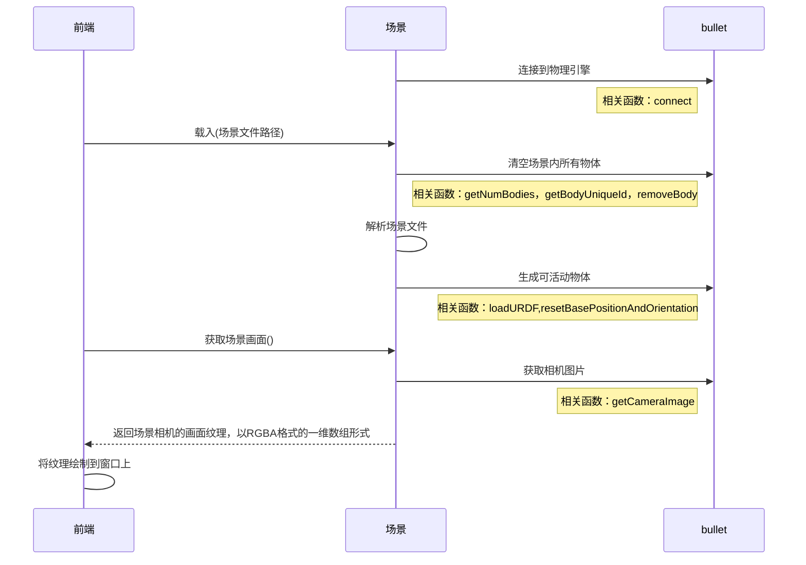
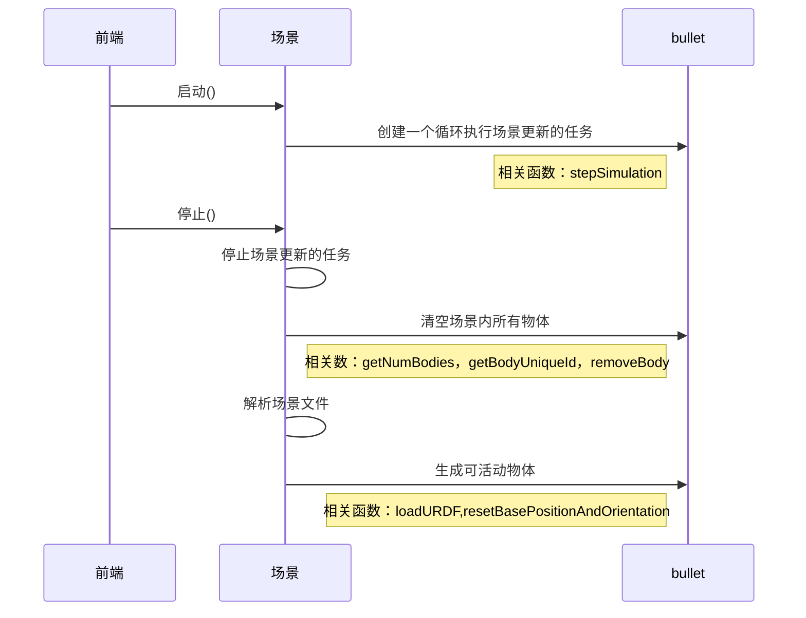
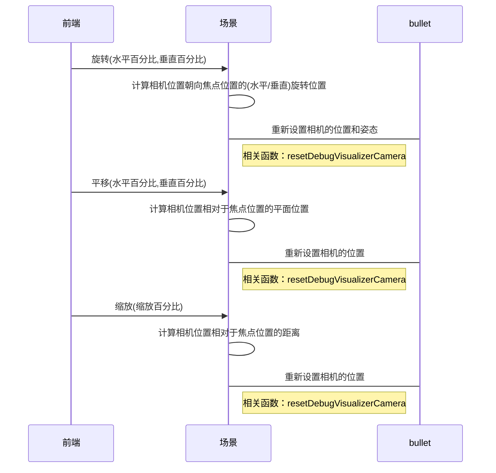
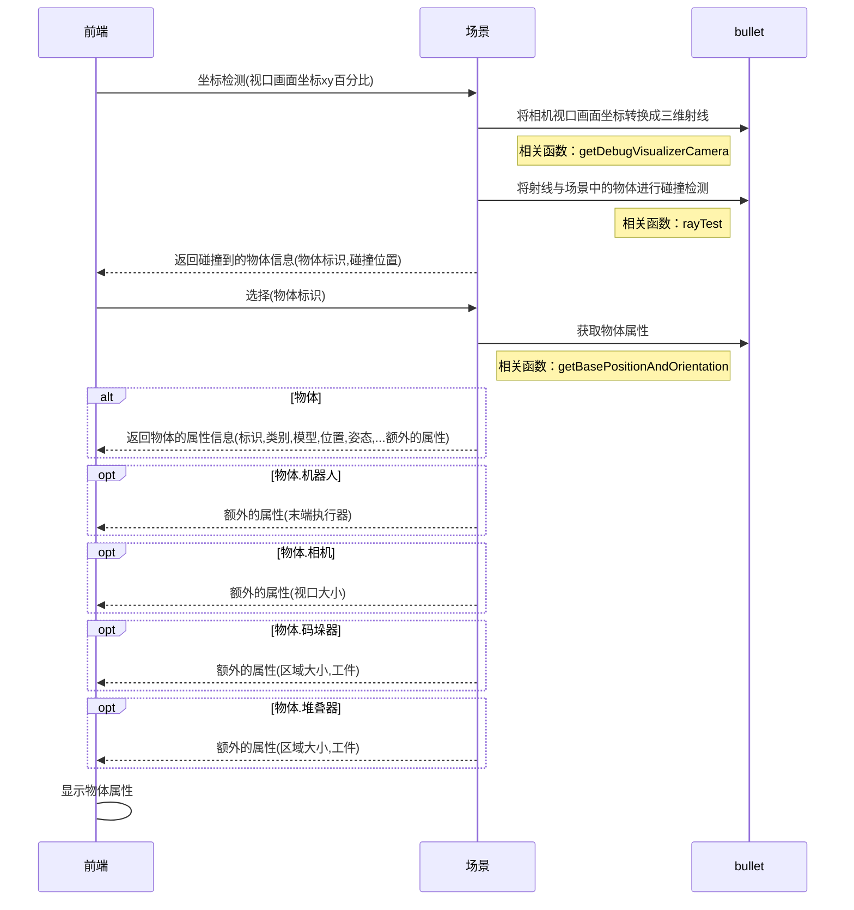
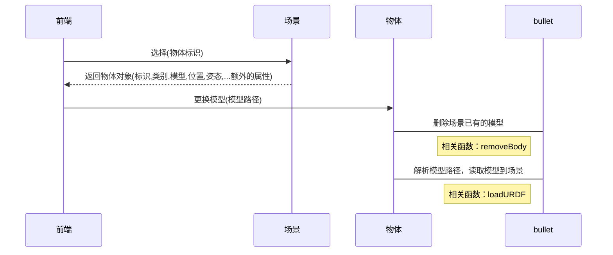
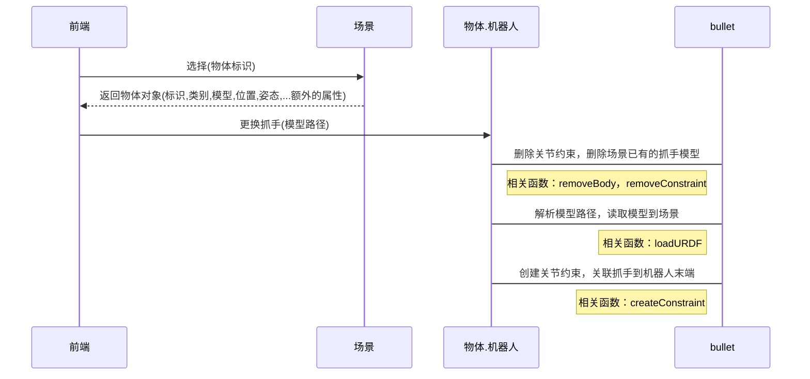
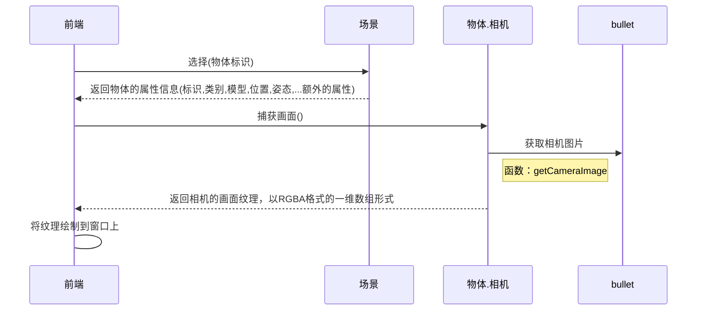
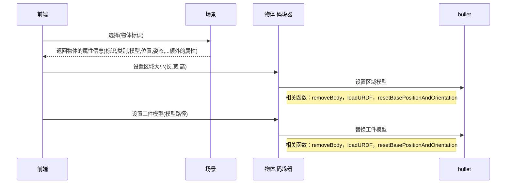
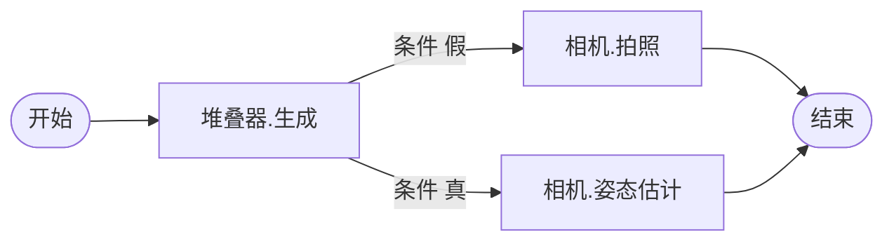
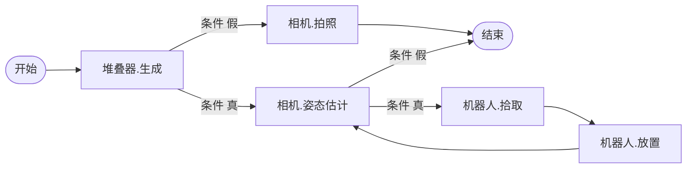

<h1 align="center">Digital-Twin</h1>

[TOC]

<div style="page-break-after: always;" ></div>

# 1 概述

        本文的目标在于梳理并定义前端业务接口规范，用于避免后端开发者在不完全了解前端业务的情况下开发出不兼容的接口。 

# 2 工作计划

| 目标   | 任务     | 问题      | 备注      |
| ---- | ------ | ------- | ------- |
| 接口定义 | 场景查看   | 载入      | 路径过长的问题 |
|      |        | 重置      |         |
|      |        | 获取物体标识  |         |
|      |        | 获取场景画面  |         |
|      |        | 继续/暂停仿真 |         |
|      |        | 平移      |         |
|      |        | 旋转      |         |
|      |        | 缩放      |         |
|      |        | 焦点      |         |
|      | 场景编辑   | 坐标检测    |         |
|      |        | 选择      |         |
|      |        | 添加      |         |
|      |        | 移动      |         |
|      |        | 旋转      |         |
|      |        | 缩放      |         |
|      |        | 删除      |         |
|      |        | 保存      |         |
|      | 物体     | 属性      |         |
|      |        | 模型更换    |         |
|      | 物体.机械臂 | 抓手更换    |         |
|      | 物体.相机  | 获取相机画面  |         |
|      | 物体.码垛器 | 区域参数    |         |
|      |        | 工件更换    |         |
|      | 物体.堆叠器 | 区域参数    |         |
|      |        | 工件更换    |         |
|      | 工作流    | 获取可用节点  |         |
|      |        | 设置/获取   |         |
|      |        | 启动/停止   |         |
|      |        |         |         |

# 3 业务流程

## 3.1 场景-载入场景并获取画面

        通过解析一个场景文件并加载其定义的物体到分拣场景中，通过渲染到纹理技术获取场景画面到前端显示。  

        文件定义如下：

```python
scene_profile = {
    "active_objects": [
        {
            "kind":"Robot",
            "name":"robot",
            "base":"./data/robots/ur5.urdf",
            "pos":[0,0,0],
            "rpy":[0,0,1.57],
            "end_effector":"./data/end_effectors/magnet.urdf",
            "end_effector_kind": "Gripper" # 夹爪：Gripper，吸盘：Suction
        },
        {
            "kind":"Stacker",
            "name":"stacker",
            "base":"./data/workpieces/bin.urdf",
            "pos":[-0.249507,-0.842426,0.001],
            "rpy":[0,0,0],
            "size":[0.5, 0.5, 0.1]
        }, 
        {
            "kind":"Camera3D",
            "name":"camera",
            "base":"./data/objects/camera3d.urdf",
            "pos":[-0.492021,-0.593407,0.0],
            "rpy":[0.0,0.0,-1.57],
            "image_size": [300,300],
            "fov": 45,
            "forcal": 0.01
        }
    ],

    "workflow": {...} # 工作流
}
```



## 3.2 场景-启动/停止

        当场景布置完毕后，执行启动即可持续进行物理运算。停止则暂停物理运算。



## 3.3 场景-视口控制

        用户会经常使用鼠标或者手势进行镜头控制。



## 3.4 场景-获取选中物体的信息

        用户在布置场景的时候会通过鼠标获取物体的各种信息。



## 3.5 物体-更换模型

        用户布置场景的时候会对模型进行替换。



## 3.6 物体.机器人-更换抓手

        用户在为不同工件采用不同的机器人抓手。



## 3.7 物体.相机-捕获画面

        虚拟相机的拍照功能。



## 3.8 物体.码垛器

        用于生成码放有序的工件。



## 3.9 物体.堆叠器

        用于生成码放无序的工件。


## 3.10 工作流-示例-RGBD图/姿态估计/混合拆垛/无序抓取

        通过简单的两个节点来实现获取RGBD图的工作流，如下：


```python
# 格式：json
workflow={
    "run":"1",
    "declare":{
        "1":{"kind":"Packer","fun":"generate","name":"packer",next:"2"},
        "2":{"kind":"Camera","fun":"capture","name":"camera"},
    }
}
```

        假设工件生成失败，就只拍照，否则对工件进行姿态估计，如下：



```python
# 格式：json
workflow={
    "run":"1",
    "declare":{
        "1":{
            "kind":"Packer","fun":"generate","name":"packer",
            "alt":[
                 {"next":"2","cond":"result == False"},
                 {"next":"3","cond":"result == True"},
            ]
        },
        "2":{"kind":"Camera","fun":"capture","name":"camera"},
        "3":{"kind":"Camera","fun":"pose_recognize","name":"camera"}
    }
}
```

        接着，加入机器人进行分拣的工作，如下：



```python
# 格式：json
flowchart={
    "run":"1",
    "declare":{
        "1":{
            "kind":"Packer","fun":"generate","name":"packer",
            "alt":[
                 {"next":"2","cond":"result == False"},
                 {"next":"3","cond":"result == True"},
            ]
        },
        "2":{"kind":"Camera","fun":"capture","name":"camera"}
        "3":{
            "kind":"Camera","fun":"pose_recognize","name":"camera",
            "alt":[
                 {"next":"4","cond":"result == True"}
            ]
        },
        "4":{"kind":"Robot","fun":"pick","name":"robot","next":"5"},
        "5":{"kind":"Robot","fun":"place","name":"robot","next":"3"}
    }
}
```

## 3.11 工作流-获取活动节点

        绘制流程图前，前端需要知道流程图由多少种节点构成，通过这个函数可以得到场景中所有可用的节点及功能，并用名字区分实体。

```python
#输入
get_active_obj_nodes()

#输出
[
    {
        "kind": "Robot", #机器人节点
        "funs": [   #可用功能
            "move",
            "pick",
            "place"
        ],
        "names": [ #场景实体名
            "robot_1",
            "robot_2"
        ]
    },
    {
        "kind": "Camera3D", #相机节点
        "funs": [   #可用功能
            "capture",
            "pose_recognize"
        ],
        "names": [ #场景实体名
            "camera_1",
            "camera_2"
        ]
    }
]
```

## 3.12 工作流-获取/设置

        前端要去绘制一个场景的工作流程时，首先要去调用获取函数得到流程信息（中文翻译由前端完成）。修改完流程后调用设置函数去保存工作流程信息。

## 3.13 工作流-启动/停止

        让整个场景工作起来，调用启动函数。需要突然终止则调用停止函数。
