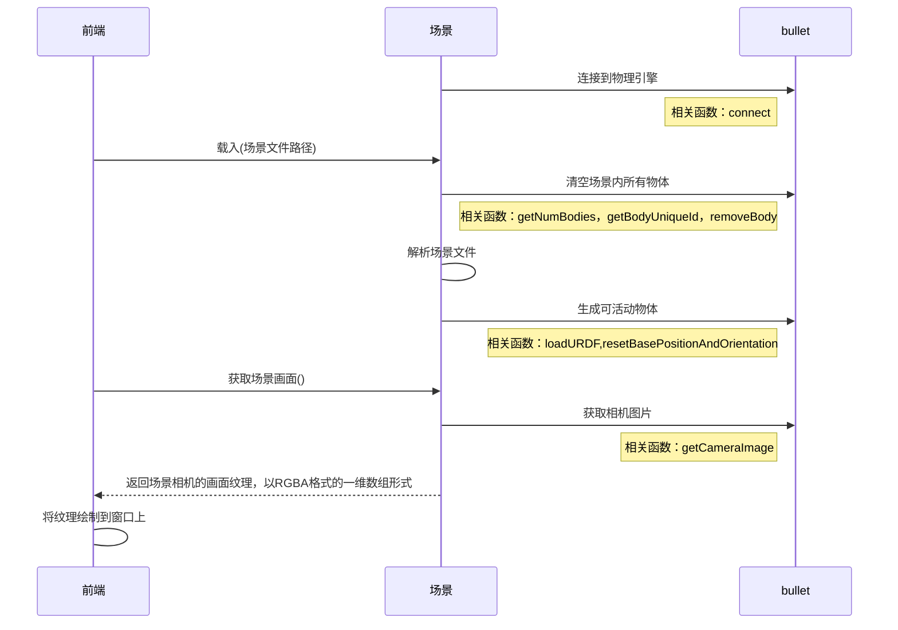
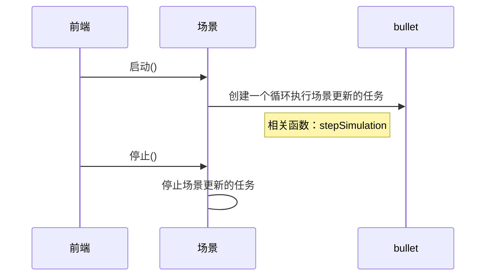
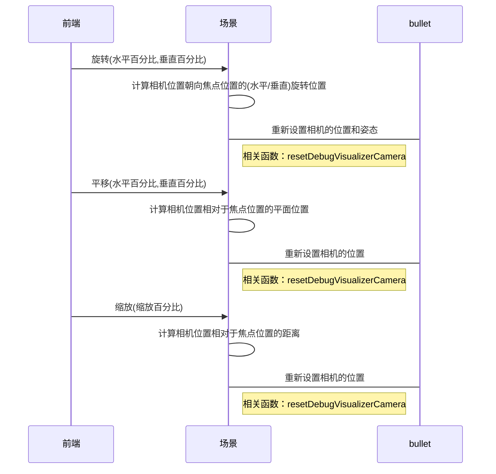
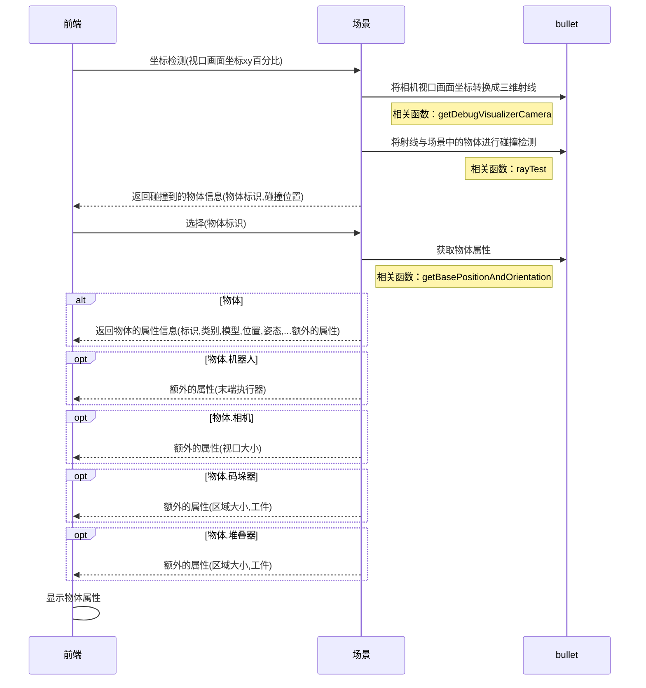
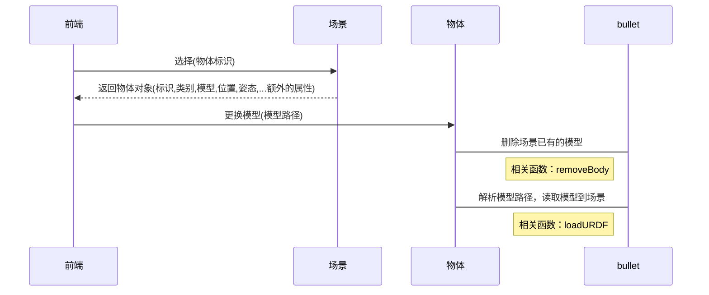
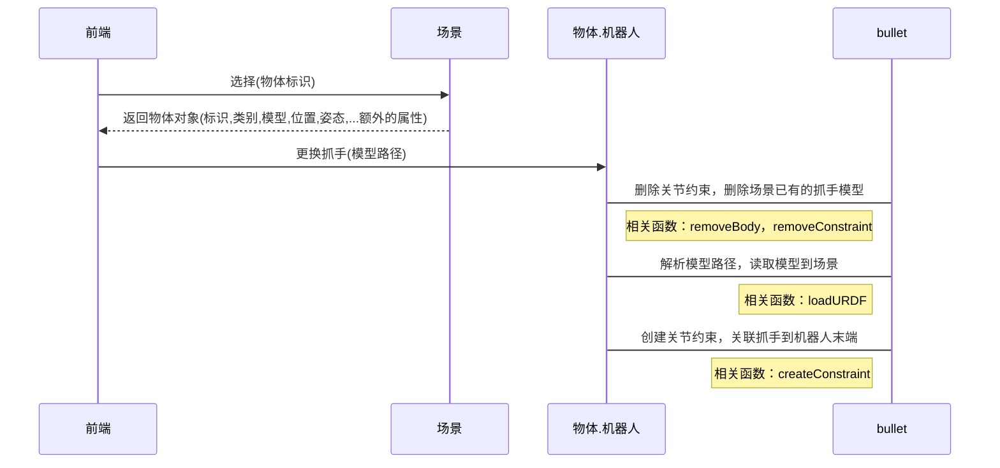
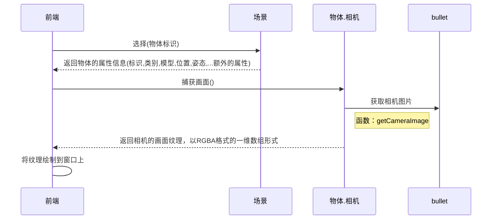
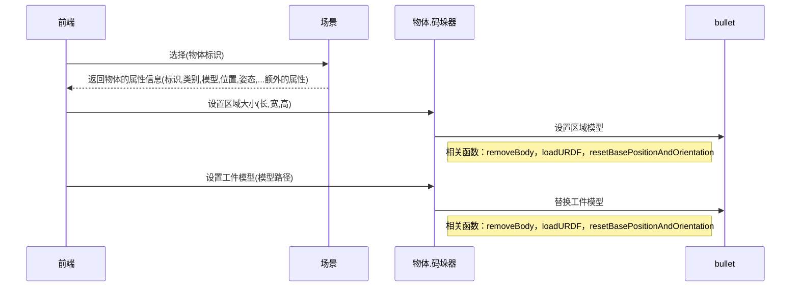
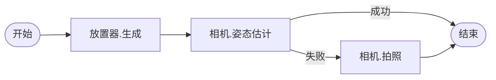

<h1 align="center">Practical Room</h1>

[TOC]

<div style="page-break-after: always;" ></div>

# 1. 概述

        此项目能够提供实践派们一个简易的数字孪生测试框架，其中包括：单目相机，深度相机，多轴机械臂，3D打印机等一系列的物件。

## 安装

包：`pip3 install practical-room`

源代码：`https://github.com/sltruman/practical-room`

### 示例

获取一堆工件的深度图：`python3 examples/depth_image.py`

获取一堆工件的标注图：`python3 examples/labeled_image.py`

混合拆垛演示：`python3 examples/ordered_picking.py`

无序抓取演示：`python3 examples/unordered_picking.py`

虚拟相机拍摄点云：`python3 examples/point_cloud.py`

标定： `python3 examples/calibration.py`

# 2. 功能列表

| 目标   | 任务       | 问题               | 备注         |
| ---- | -------- | ---------------- | ---------- |
| 接口实现 | 场景查看     | 载入/重置            |            |
|      |          | 获取物体标识           |            |
|      |          | 获取场景画面           |            |
|      |          | 暂停/继续仿真          |            |
|      |          | 平移/旋转/缩放/焦点      |            |
|      |          | 关闭场景             |            |
|      | 场景编辑     | 基础模型             |            |
|      |          | 坐标检测             |            |
|      |          | 选择/添加/删除/保存      |            |
|      |          | 透明化              |            |
|      |          | 移动/旋转/缩放         |            |
|      | 物体       | 位置/姿态            |            |
|      |          | 标识               |            |
|      |          | 模型更换             |            |
|      |          | 纹理更换             |            |
|      | 物体.标定板   | 获取/设置尺寸          |            |
|      |          | 获取/设置类别          | 实心圆/棋盘格/标记 |
|      | 物体.机械臂   | 获取/设置末端执行器       |            |
|      |          | 获取/设置末端执行器-位置/姿态 |            |
|      |          | 设置末端执行器-数字输出     |            |
|      |          | 获取/设置关节位置        |            |
|      |          | 获取/设置速度          |            |
|      |          | 设置/前往休息点         |            |
|      | 物体.相机    | 获取相机画面           |            |
|      |          | 获取/设置内参外参        |            |
|      |          | 设置/清除点云          |            |
|      | 物体.码垛器   | 区域参数             |            |
|      |          | 工件更换             |            |
|      | 物体.放置器   | 区域参数             |            |
|      |          | 获取/设置工件          |            |
|      |          | 获取/设置工件纹理        |            |
|      |          | 获取/设置放置点         |            |
|      |          | 获取/设置总计工件数       |            |
|      |          | 获取/设置缩放因子        |            |
|      |          | 获取/设置放置模式        |            |
|      | 物体.雕刻机   |                  |            |
|      |          |                  |            |
|      | 物体.三维打印机 |                  |            |
|      |          |                  |            |
|      | 工作流      | 获取可用节点           |            |
|      |          | 设置/获取            |            |
|      |          | 启动/停止            |            |
|      |          |                  |            |

# 3. 功能接口

## 场景-载入场景并获取画面

        通过解析一个场景文件并加载其定义的物体到分拣场景中，通过渲染到纹理技术获取场景画面到前端显示。  

        文件定义如下：

```python
scene_profile = {
    "active_objects": [
        {
            "kind":"Robot",
            "name":"robot",
            "base":"./data/robots/ur5.urdf",
            "pos":[0,0,0],
            "rot":[0,0,1.57],
            "end_effector":"./data/end_effectors/magnet.urdf"
        },
        {
            "kind":"Placer",
            "name":"placer",
            "base":"./data/objects/tray/traybox.urdf",
            "pos":[0,-0.5,0.001],
            "rot":[0,0,0],
            "center":[0.0,-0.5,0.25],
            "interval":0.1,
            "amount":30,
            "workpiece":"./data/workpieces/lego/lego.urdf"
        }, 
        {
            "kind":"Camera3D",
            "name":"camera",
            "base":"./data/cameras/camera3d.urdf",
            "pos":[-0.5,-0.5,0.0],
            "rot":[0.0,0.0,-1.57],
            "fov": 45,
            "forcal": 0.01,
            "image_size": [300,300],
            "image_path":"./guagua.png"
        }
    ],

    "workflow": {...} # 工作流
}
```



### Python

```python
import os
from digitaltwin import Scene
import digitaltwin_data

data_dir = digitaltwin_data.get_data_path()
scene = Scene(1024,768,data_dir)
scene.load(os.path.join(data_dir,'scenes/空.json'))

rgba = scene.rtt()
```

## 场景-启动/停止

        当场景布置完毕后，执行启动即可持续进行物理运算。停止则暂停物理运算。



### Python

```python
from threading import Thread
from digitaltwin import Scene,Workflow,Editor
import digitaltwin_data
import os
import time

data_dir = digitaltwin_data.get_data_path()
scene = Scene(1024,768,data_dir)
editor = Editor(scene)
scene.load(os.path.join(data_dir,'scenes/混合拆垛.json'))

stacker = scene.active_objs_by_name['stacker']
stacker.generate()

playing = True
def updating():
    while playing:
        scene.update_for_tick(1/180.)
        time.sleep(1/180.)

t = Thread(target=updating)
t.start()

time.sleep(1)

playing = False
time.sleep(1)

playing = True
t = Thread(target=updating)
t.start()
```

## 场景-视口控制

        用户会经常使用鼠标或者手势进行镜头控制。



### Python

```python
from threading import Thread
from digitaltwin import Scene,Workflow,Editor
import digitaltwin_data
import os
import time

data_dir = digitaltwin_data.get_data_path()
scene = Scene(1024,768,data_dir)
scene.load(os.path.join(data_dir,'scenes/空.json'))

def updating():
    import time
    while True:
        scene.update_for_tick(1/180.)
        time.sleep(1/180.)

t = Thread(target=updating)
t.start()

while True:
    time.sleep(0.1)
    scene.rotate(0.001,0)
    time.sleep(0.1)
    scene.pan(0.001,0)
```

## 场景-获取选中物体的信息

        用户在布置场景的时候会通过鼠标获取物体的各种信息。



### Python

```python
from threading import Thread
from digitaltwin import Scene,Workflow,Editor
import digitaltwin_data
import os
import time

data_dir = digitaltwin_data.get_data_path()
scene = Scene(1024,768,data_dir)
editor = Editor(scene)
scene.load(os.path.join(data_dir,'scenes/标定测试.json'))

def updating():
    import time
    while True:
        scene.update_for_tick(1/180.)
        time.sleep(1/180.)

t = Thread(target=updating)
t.start()

obj = editor.ray(0.5,0.5)
print(obj)

robot = scene.active_objs_by_name[obj['name']]
print(robot.get_pos())
```

## 场景-保存

        当对场景的物体进行修改之后，调用此函数来进行保存。

### Python

```python
from threading import Thread
from digitaltwin import Scene,Workflow,Editor
import digitaltwin_data
import os
import time

data_dir = digitaltwin_data.get_data_path()
scene = Scene(1024,768,data_dir)
editor = Editor(scene)
scene.load(os.path.join(data_dir,'scenes/标定测试.json'))

def updating():
    while True:
        scene.update_for_tick(1/180.)
        time.sleep(1/180.)

t = Thread(target=updating)
t.start()

plane = scene.active_objs_by_name['plane']

plane.set_pos([0,0,1])
scene.save()
```

## 场景.编辑-基础模型

### Python

```python
import time
from digitaltwin import Scene,Workflow,Editor
import os
from threading import Thread
import numpy as np
import digitaltwin_data

data_dir = digitaltwin_data.get_data_path()

scene = Scene(1024,768,data_dir)
editor = Editor(scene)

scene.load(os.path.join(data_dir,'scenes/空.json'))

def updating():
    while True:
        scene.update_for_tick(1/180.)
        time.sleep(1/180.)

t = Thread(target=updating)
t.start()

editor.add_cube([0,0,0],[0,0,0],[1,0.5,0.5])
editor.add_cylinder([1,0,0],[0,0,0],0.5,0.5)
editor.add_box([-1,0,0],[0,0,0],[1,1,0.5],0.1)
```

## 场景.编辑-机械臂

### Python

```python
from threading import Thread
import time
from digitaltwin import Scene,Editor

scene = Scene(1024, 768)
scene.load('./digitaltwin_data/scenes/空.json')
editor = Editor(scene)

def updating():
    while True:
        scene.update_for_tick(1/180.)
        time.sleep(1/180.)

t = Thread(target=updating)
t.start()

obj = editor.add('Robot','robots/gp12/gp12.urdf',[0,0,1],[0,0,0],[1,0,0])
scene.active_objs_by_name[obj['name']].set_end_effector('end_effectors/gripper_gp12/gripper_gp12.urdf')
```

## 场景.编辑-删除

### Python

```python
from threading import Thread
import time
from digitaltwin import Scene,Editor

scene = Scene(1024, 768)
scene.load('./digitaltwin_data/scenes/空.json')
editor = Editor(scene)


def updating():
    while True:
        scene.update_for_tick(1/180.)
        time.sleep(1/180.)

t = Thread(target=updating)
t.start()

obj = editor.add('Robot','robots/gp12/gp12.urdf',[0,0,1],[0,0,0],[1,0,0])
editor.remove(obj['name'])
```

## 物体-更换模型

        用户布置场景的时候会对模型进行替换。



### Python

```python
from threading import Thread
from digitaltwin import Scene,Workflow,Editor
import digitaltwin_data
import os
import time

data_dir = digitaltwin_data.get_data_path()
scene = Scene(1024,768,data_dir)
editor = Editor(scene)
scene.load(os.path.join(data_dir,'scenes/标定测试.json'))

def updating():
    import time
    while True:
        scene.update_for_tick(1/180.)
        time.sleep(1/180.)

t = Thread(target=updating)
t.start()

plane = scene.active_objs_by_name['plane']
plane.set_base('containers/tray/tray.urdf')
```

## 物体.机械臂-末端执行器

        用户为不同工件采用不同的机器人抓手。



### Python

```python
from threading import Thread
from digitaltwin import Scene,Workflow,Editor
import digitaltwin_data
import os

data_dir = digitaltwin_data.get_data_path()
scene = Scene(1024,768,data_dir)
editor = Editor(scene)
scene.load(os.path.join(data_dir,'scenes/标定测试.json'))

def updating():
    import time
    while True:
        scene.update_for_tick(1/180.)
        time.sleep(1/180.)

t = Thread(target=updating)
t.start()

robot = scene.active_objs_by_name['robot']
robot.set_end_effector('end_effectors/gripper_ur5/gripper_ur5.urdf')
```

## 物体.机械臂-末端执行器-位姿

### Python

```python
from threading import Thread
from digitaltwin import Scene
import digitaltwin_data
import os

data_dir = digitaltwin_data.get_data_path()
scene = Scene(1024,768,data_dir)
scene.load(os.path.join(data_dir,'scenes/标定测试.json'))

def updating():
    import time
    while True:
        scene.update_for_tick(1/180.)
        time.sleep(1/180.)

t = Thread(target=updating)
t.start()

robot = scene.active_objs_by_name['robot']
robot.set_end_effector_pose([0,-0.5,0.1,0.785,0,0])
```

## 物体.机械臂-末端执行器-数字输出

### Python

```python
from threading import Thread
from digitaltwin import Scene,Workflow,Editor
import digitaltwin_data
import os
import time


data_dir = digitaltwin_data.get_data_path()
scene = Scene(1024,768,data_dir)
editor = Editor(scene)
scene.load(os.path.join(data_dir,'scenes/无序抓取-真实.json'))

def updating():
    import time
    while True:
        scene.update_for_tick(1/180.)
        time.sleep(1/180.)

t = Thread(target=updating)
t.start()

robot = scene.active_objs_by_name['robot']

time.sleep(2)
robot.end_effector_obj.do(True)
time.sleep(2)
robot.end_effector_obj.do(False)
```

## 物体.机械臂-关节控制

### Python

```python
from threading import Thread
from digitaltwin import Scene,Workflow,Editor
import digitaltwin_data
import os
import time


data_dir = digitaltwin_data.get_data_path()
scene = Scene(1024,768,data_dir)
editor = Editor(scene)
scene.load(os.path.join(data_dir,'scenes/标定测试.json'))

def updating():
    import time
    while True:
        scene.update_for_tick(1/180.)
        time.sleep(1/180.)

t = Thread(target=updating)
t.start()

robot = scene.active_objs_by_name['robot']

route_joint_positions = [
    [0.0,0,0,0,0,0.0],
    [0.1,0,0,0,0,0.1],
    [0.2,0,0,0,0,0.2],
    [0.3,0,0,0,0,0.3],
    [0.4,0,0,0,0,0.4],
    [0.5,0,0,0,0,0.5],
    [0.6,0,0,0,0,0.6]
]

for joint_pos_list in route_joint_positions:
    robot.set_joints(joint_pos_list)
    time.sleep(0.5)
```

## 物体.机械臂-速度控制

### Python

```python
from threading import Thread
from digitaltwin import Scene,Workflow,Editor
import digitaltwin_data
import os
import time

data_dir = digitaltwin_data.get_data_path()
scene = Scene(1024,768,data_dir)
editor = Editor(scene)
scene.load(os.path.join(data_dir,'scenes/标定测试.json'))

def updating():
    import time
    while True:
        scene.update_for_tick(1/180.)
        time.sleep(1/180.)

t = Thread(target=updating)
t.start()

robot = scene.active_objs_by_name['robot']
robot.signal_move(
    mode='joint',
    speed=0.1,
    point=[0,-0.5,0.1,0.785,0,0])
```

## 物体.相机-捕获画面

        虚拟相机的拍照功能。



### Python

```python
from threading import Thread
from digitaltwin import Scene,Workflow,Editor
import digitaltwin_data
import os
import time

data_dir = digitaltwin_data.get_data_path()
scene = Scene(1024,768,data_dir)
editor = Editor(scene)
scene.load(os.path.join(data_dir,'scenes/标定测试.json'))

def updating():
    import time
    while True:
        scene.update_for_tick(1/180.)
        time.sleep(1/180.)

t = Thread(target=updating)
t.start()

camera = scene.active_objs_by_name['camera']

rgba,depth = camera.rtt()
print(len(rgba),len(depth))
```

## 物体.相机-设置/清除点云

### Python

```python
import time
from digitaltwin import Scene, Workflow,Editor
import digitaltwin_data
from threading import Thread
import os

projection = [
    [2393.230224609375,0.0,951.794189453125],
    [0.0,2393.364501953125,558.6798095703125],
    [0.0,0.0,1.0]]

eye_to_hand_transform = [
    [0.08766222494286922,0.9954482545931286,0.037391265631955106,0.7793440568869567],
    [0.9619166950744155,-0.09434572446817567,0.25654464720919273,-0.2510889858020945],
    [0.258904627334428,0.013478008089797142,-0.9658088512965427,1.2629839393068865],
    [0.0,0.0,0.0,1.0]]

data_dir = digitaltwin_data.get_data_path()

scene = Scene(1024, 768)
editor = Editor(scene)
scene.load(os.path.join(data_dir,'scenes/算法插件.json'))

def updating():
    import time
    while True:
        scene.update_for_tick(1/180.)
        time.sleep(1/180.)

t = Thread(target=updating)
t.start()

scene.active_objs_by_name['camera'].set_calibration(projection,eye_to_hand_transform)
editor.add_cube([0,0,-0.7],[0,0,0],[0.5,0.5,0.7])

import pymeshlab as meshlab
ms = meshlab.MeshSet()
ms.load_new_mesh('./20230530194453412/Builder/foreground/output/20230530194453412.ply')
m = ms.current_mesh()
vs = m.vertex_matrix()
fs = m.face_matrix()
vcs = m.vertex_color_matrix()[:,:3]

scene.active_objs_by_name['camera'].draw_point_cloud(vs,vcs)
scene.active_objs_by_name['camera'].clear_point_cloud()
```

## 物体.码垛器

        用于生成码放有序的工件。



### Python

```python
from threading import Thread
from digitaltwin import Scene,Workflow,Editor
import digitaltwin_data
import os
import time

data_dir = digitaltwin_data.get_data_path()
scene = Scene(1024,768,data_dir)
editor = Editor(scene)
scene.load(os.path.join(data_dir,'scenes/混合拆垛.json'))

def updating():
    import time
    while True:
        scene.update_for_tick(1/180.)
        time.sleep(1/180.)

t = Thread(target=updating)
t.start()

stacker = scene.active_objs_by_name['stacker']
stacker.generate()
```

## 物体.放置器

        用于生成码放无序的工件。


### Python

```python
from threading import Thread
from digitaltwin import Scene,Workflow,Editor
import digitaltwin_data
import os
import time

data_dir = digitaltwin_data.get_data_path()
scene = Scene(1024,768,data_dir)
editor = Editor(scene)
scene.load(os.path.join(data_dir,'scenes/无序抓取.json'))

def updating():
    import time
    while True:
        scene.update_for_tick(1/180.)
        time.sleep(1/180.)

t = Thread(target=updating)
t.start()

placer = scene.active_objs_by_name['placer']
placer.generate()
```

## 物体.三维打印机


## 工作流-示例-深度图/姿态估计/混合拆垛/无序抓取

        通过简单的两个节点来实现获取深度图的工作流，如下：


```python
scene_profile = {
    "active_objects": [{
            "kind":"Placer",
            "name":"placer",
            "base":"./data/objects/tray/traybox.urdf",
            "pos":[0,-0.5,0.001],
            "rot":[0,0,0],
            "center":[0.0,-0.5,0.25],
            "interval":0.1,
            "amount":30,
            "workpiece":"./data/workpieces/lego/lego.urdf"
        },{
            "kind":"Camera3D",
            "name":"camera",
            "base":"./data/cameras/camera3d.urdf",
            "pos":[-0.5,-0.5,0.0],
            "rot":[0.0,0.0,-1.57],
            "fov": 45,
            "forcal": 0.01,
            "image_size": [300,300],
            "image_path":"./guagua.png"
        }
    ],

    "workflow":{
        "run":"1",
        "declare":{
            "1":{"kind":"Packer","fun":"generate","name":"placer","next":"2"},
            "2":{"kind":"Camera","fun":"capture","name":"camera"}
        }
    }
}
```

```python
from threading import Thread
from digitaltwin import Scene,Workflow,Editor
import digitaltwin_data
import os
import time


data_dir = digitaltwin_data.get_data_path()
scene = Scene(1024,768,data_dir)
editor = Editor(scene)
workflow = Workflow(scene)
scene.load(os.path.join(data_dir,'scenes/深度图.json'))


def updating():
    while True:
        scene.update_for_tick(1/180.)
        time.sleep(1/180.)

t = Thread(target=updating)
t.start()

workflow.start()
```

        节点有时因为一些限制参数会返回失败，为应对于不同情况，可以采用分支来进行控制。假设姿态估计失败就拍照，如下：



```python
scene_profile = {
    "active_objects": [
        {
            "kind":"Placer",
            "name":"placer",
            "base":"./data/objects/tray/traybox.urdf",
            "pos":[0,-0.5,0.001],
            "rot":[0,0,0],
            "center":[0.0,-0.5,0.25],
            "interval":0.1,
            "amount":10,
            "workpiece":"./data/workpieces/lego/lego.urdf"
        }, 
        {
            "kind":"Camera3D",
            "name":"camera",
            "base":"./data/cameras/camera3d.urdf",
            "pos":[-0.5,-0.5,0.0],
            "rot":[0.0,0.0,-1.57],
            "fov": 20,
            "forcal": 0.01,
            "sample_rate": 20, 
            "image_size": [300,300]
        }
    ],
    "workflow":{
        "run":"1",
        "declare":{
            "1":{"kind":"Placer","fun":"generate","name":"placer","next":"2"},
            "2":{"kind":"Camera","fun":"pose_recognize","name":"camera",
                "alt":[
                    {"next":"3","err":"failed"}
                ]
            },
            "3":{"kind":"Camera","fun":"capture","name":"camera"}
        }
    }
}
```

```python
from threading import Thread
from digitaltwin import Scene,Workflow,Editor
import digitaltwin_data
import os
import time


data_dir = digitaltwin_data.get_data_path()
scene = Scene(1024,768,data_dir)
editor = Editor(scene)
workflow = Workflow(scene)
scene.load(os.path.join(data_dir,'scenes/姿态估计.json'))


def updating():
    while True:
        scene.update_for_tick(1/180.)
        time.sleep(1/180.)

t = Thread(target=updating)
t.start()

workflow.start()
```

        接着，设计一个混合拆垛工作流，加入机器人进行分拣工作，如下：


```python
# 格式：json
scene_profile={
    "active_objects": [
        {
            "kind":"Robot",
            "name":"robot",
            "base":"./data/robots/ur5/ur5.urdf",
            "pos":[0,0,0],
            "rot":[0,0,3.14],
            "reset_joint_poses":[-1.57,0.0,-0.3925,-0.785,1.57,0],
            "joint_damping":[ 0, 1, 0.9, 0.8, 0.7, 0.0],
            "end_effector":"./data/end_effectors/suction/suction.urdf"
        },
        {
            "kind":"Stacker",
            "name":"stacker",
            "base":"./data/objects/tray/traybox.urdf",
            "pos":[0,-0.52,0.01],
            "rot":[0,0,0],
            "area":[0.3,0.3,0.3],
            "box_size":[0.1,0.1,0.05],
            "random_factor":[0.2,0.2,0.0]
        }, 
        {
            "kind":"Camera3D",
            "name":"camera",
            "base":"./data/cameras/camera3d.urdf",
            "pos":[-0.5,-0.52,0.0],
            "rot":[0.0,0.0,-1.57],
            "fov": 20,
            "forcal": 0.01,
            "sample_rate": 20, 
            "image_size": [300,300],
            "image_path":"./guagua.png"
        }
    ],

    "workflow": {
        "run":"1",
        "declare":{
            "1":{"kind":"Stacker","fun":"generate","name":"stacker", "next":"2"},
            "2":{
                "kind":"Camera3D","fun":"pose_recognize","name":"camera", "next":"3",
                "alt":[
                    {"next":"7","err": "failed"}
                ]
            },
            "3":{"kind":"Robot","fun":"pick_plan","name":"robot","next":"4","args":{
                "pick_poses":[
                    {"pos":[0.0,0.0,0.024],"rot":[0,0,0]}
                ]
            }},
            "4":{"kind":"Robot","fun":"plan_move","name":"robot","next":"5"},
            "5":{"kind":"Robot","fun":"do","name":"robot","args":{"pickup": true},"next":"6"},
            "6":{"kind":"Robot","fun":"move_relatively","name":"robot","args":{"x":0.0,"y":0.0,"z":0.1},"next":"7"},
            "7":{"kind":"Robot","fun":"move","name":"robot","args":{"x":0.5,"y":0.0,"z":0.5},"next":"8"},  
            "8":{"kind":"Robot","fun":"do","name":"robot","args":{"pickup": false},"next":"9"},
            "9":{"kind":"Robot","fun":"home","name":"robot","next":"2"}
        }
    }
}
```

```python
from threading import Thread
from digitaltwin import Scene,Workflow,Editor
import digitaltwin_data
import os
import time


data_dir = digitaltwin_data.get_data_path()
scene = Scene(1024,768,data_dir)
editor = Editor(scene)
workflow = Workflow(scene)
scene.load(os.path.join(data_dir,'scenes/混合拆垛.json'))


def updating():
    while True:
        scene.update_for_tick(1/180.)
        time.sleep(1/180.)

t = Thread(target=updating)
t.start()

workflow.start()
```

        最后，设计一个无序抓取的工作流，因为内置算法太垃圾，在此加入第三方路径规划算法，如下：


```python
scene_profile={
    "active_objects": [
        {
            "kind":"Robot",
            "name":"robot",
            "base":"./data/robots/ur5/ur5.urdf",
            "pos":[0,0.1,0],
            "rot":[0,0,3.14],
            "reset_joint_poses":[-1.57,0.0,-0.3925,-0.785,1.57,0],
            "joint_damping":[ 0, 1, 0.9, 0.8, 0.7, 0.0],
            "end_effector":"./data/end_effectors/gripper/gripper.urdf"
        },
        {
            "kind":"Placer",
            "name":"placer",
            "base":"./data/objects/tray/traybox.urdf",
            "pos":[0,-0.5,0.001],
            "rot":[0,0,0], 
            "center":[0.0,-0.5,0.25],
            "interval":0.1,
            "amount":10,
            "workpiece":"./data/workpieces/suction/suction.urdf",
            "workpiece_texture":""
        }, 
        {
            "kind":"Camera3D",
            "name":"camera",
            "base":"./data/cameras/camera3d.urdf",
            "pos":[-0.5,-0.5,0.0],
            "rot":[0.0,0.0,-1.57],
            "fov": 20,
            "forcal": 0.01,
            "sample_rate": 20, 
            "image_size": [300,300],
            "image_path":"./guagua.png"
        }
    ],

    "workflow":{
        "run":"1",
        "declare":{
            "1":{"kind":"Placer","fun":"generate","name":"placer", "next":"2"},
            "2":{
                "kind":"Camera3D","fun":"pose_recognize","name":"camera", "next":"3",
                "alt":[{"next":"7","err": "failed"}]
            },
            "3":{"kind":"Robot","fun":"pick_plan","name":"robot","args":{
                "pick_poses":[
                    {"pos":[0.0,0.0,0.01],"rot":[0,1.57,0]},
                    {"pos":[0.0,0.0,0.01],"rot":[0,1.57,-0.785]},
                    {"pos":[0.0,0.0,0.01],"rot":[0,1.57,-1.57]},
                    {"pos":[0.0,0.0,0.01],"rot":[0,1.57,-2.355]},
                    {"pos":[0.0,0.0,0.01],"rot":[0,1.57,-3.14]},
                    {"pos":[0.0,0.0,0.01],"rot":[0,1.57,2.355]},
                    {"pos":[0.0,0.0,0.01],"rot":[0,1.57,1.57]},
                    {"pos":[0.0,0.0,0.01],"rot":[0,1.57,0.785]}
                ]
            },"next":"4"},
            "4":{"kind":"Robot","fun":"plan_move","name":"robot","next":"5"},
            "5":{"kind":"Robot","fun":"do","name":"robot","args":{"pickup":true},"next":"6"},
            "6":{"kind":"Robot","fun":"move_relatively","name":"robot","args":{"x":0.0,"y":0.0,"z":0.35},"next":"7"},
            "7":{"kind":"Robot","fun":"move","name":"robot","args":{"x":0.3,"y":0.1,"z":0.3},"next":"8"},
            "8":{"kind":"Robot","fun":"do","name":"robot","args":{"pickup": false},"next":"9"},
            "9":{"kind":"Robot","fun":"home","name":"robot","next":"2"}
        }
    }
}
```

```python
from threading import Thread
from digitaltwin import Scene,Workflow,Editor
import digitaltwin_data
import os
import time


data_dir = digitaltwin_data.get_data_path()
scene = Scene(1024,768,data_dir)
editor = Editor(scene)
workflow = Workflow(scene)
scene.load(os.path.join(data_dir,'scenes/无序抓取.json'))


def updating():
    while True:
        scene.update_for_tick(1/180.)
        time.sleep(1/180.)

t = Thread(target=updating)
t.start()

workflow.start()
```

## 工作流-获取活动节点

        绘制流程图前，前端需要知道流程图由多少种节点构成，通过这个函数可以得到场景中所有可用的节点及功能，并用名字区分实体。

```python
[
    {'kind':'Robot','names':[],'funs':[
        {'label':'Motion', #动作
            'f':'pick_move','errs':[], #拾取移动
            'args':[ #附加参数
                {'name':'mode','kind':'String'}, #运动模式，关节：joint 线：linear
                {'name':'speed','kind':'Flaot'}, #速度，0.0 ~ 1.0
                {'name':'pickup','kind':'Bool'}, #拾取设置
                {'name':'vision_flow','kind':'String'} #视觉流程
            ]},
        {'label':'Motion', #动作
            'f':'move','errs':[], #移动
            'args':[ #附加参数
            {'name':'mode','kind':'String'}, #运动模式，关节：joint 线：linear
            {'name':'speed','kind':'Flaot'}, #速度，值：0.0 ~ 1.0，默认：0.2
            {'name':'pickup','kind':'Bool'}, #拾取设置
            {'name':'joints','kind':'List'}, #关节位置，[弧度值1,...弧度值n]
            {'name':'point','kind':'List'},  #点位置，[x,y,z,rx,ry,rz] #米，弧度
            {'name':'home','kind':'Bool'},   #回到休息点，为true，忽略其他参数
            ]},
        {'label':'Motion', #动作
            'f':'move_relatively','errs':[], #相对移动
            'args':[ #附加参数
                {'name':'mode','kind':'String'}, #模式，关节：joint 线：linear
                {'name':'speed','kind':'Flaot'}, #速度，值：0.0 ~ 1.0，默认：0.2
                {'name':'pickup','kind':'Bool'}, #拾取设置
                {'name':'target','kind':'String'}, #相对目标，当前任务：task_current，下一个任务：task_next，选择的任务：selected，工具坐标系：frame_end_effector，机械臂坐标系：frame_robot，全局坐标系：frame_global
                {'name':'point','kind':'List'},  #点位置，[x,y,z,rx,ry,rz] #米，弧度
            ]},
        {'label':'EndEffector',
            'f':'pick','errs':[], #开
            'args':[]}, 
        {'label':'EndEffector',
            'f':'place','errs':[], #合
            'args':[]} 
        ]},
    {'kind':'Camera3DReal','names':[],'funs':[  #相机
        {'label':'Vision','f':'capture','errs':["failed"],'args':[ #拍照
            {'name':'wait_for_seconds','kind':'Float'}] #等待时间
        }
        ]},
    {'kind':'Camera3D','names':[],'funs':[  #相机
        {'label':'Vision','f':'capture','errs':["failed"],'args':[ #拍照
            {'name':'wait_for_seconds','kind':'Float'}] #等待时间
        }
        ]},
    {'kind':'Placer','names':[],'funs':[{'label':'PlacingContainer','f':'generate','errs':["failed"],'args':[]}]}, #放置器
    {'kind':'Stacker','names':[],'funs':[{'label':'StackingContainer','f':'generate','errs':["failed"],'args':[]}]}, #堆垛器
    {'kind':'Vision','names':['PickLight'],'funs':[
        {'label':'Vision','f':'detect','errs':[],'args':[ #视觉检测
            {'name':'vision_flow','kind':'String'}]} #视觉流程，？？
        ]}
]
```

## 工作流-获取/设置

        前端要去绘制一个场景的工作流程时，首先要去调用获取函数得到流程信息（中文翻译由前端完成）。修改完流程后调用设置函数去保存工作流程信息。

## 工作流-启动/停止

        让整个场景工作起来，调用启动函数。需要突然终止则调用停止函数。
